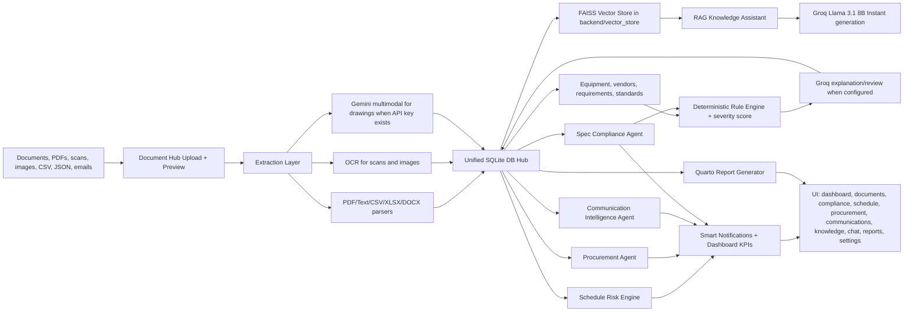

# Data-Centre Construction Project Intelligence Platform

All module outputs are persisted in `backend/ai_monitoring.db`. The vector chunks and FAISS index are persisted in `backend/vector_store/`. Existing DBs are migrated and backfilled on `hub.initialize()` so extracted documents gain equipment/vendor/standard records and deterministic rule evaluations without deleting prior data.
