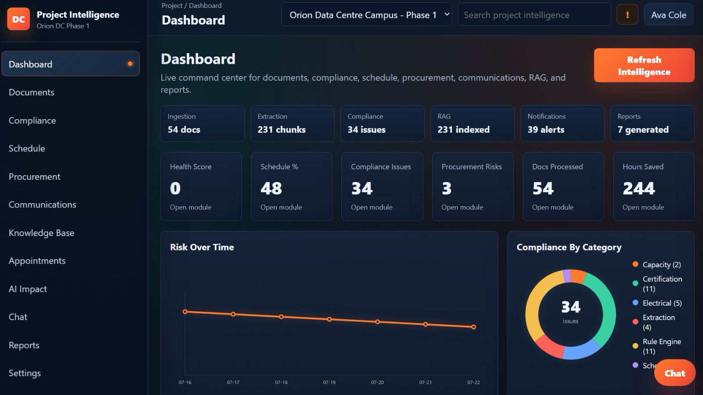
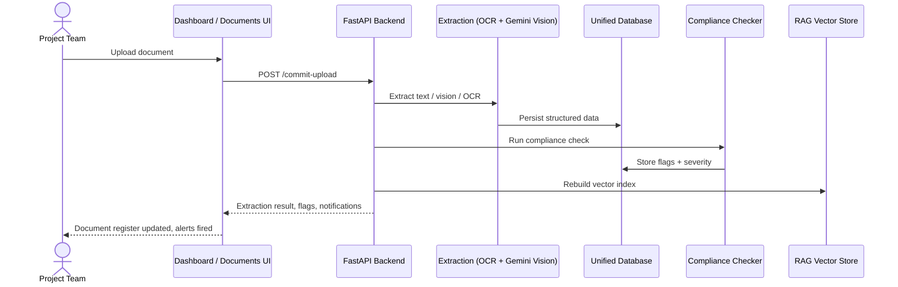
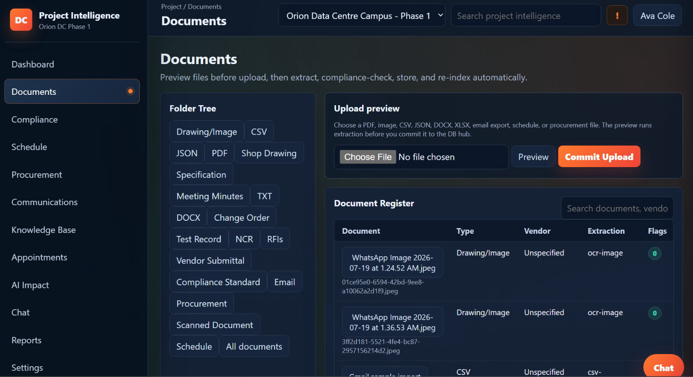
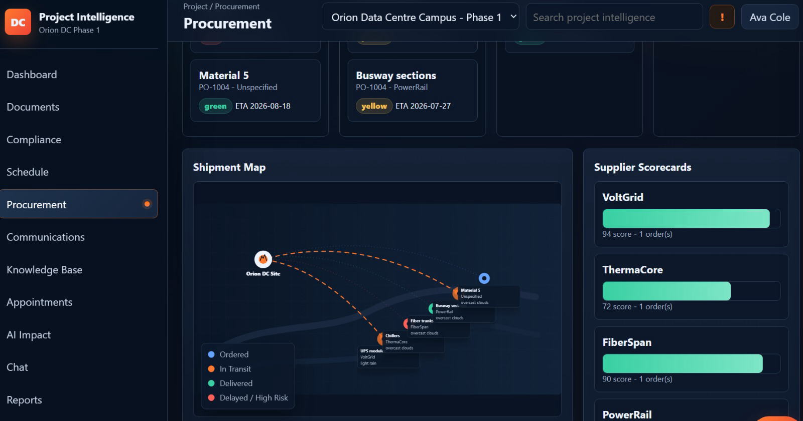
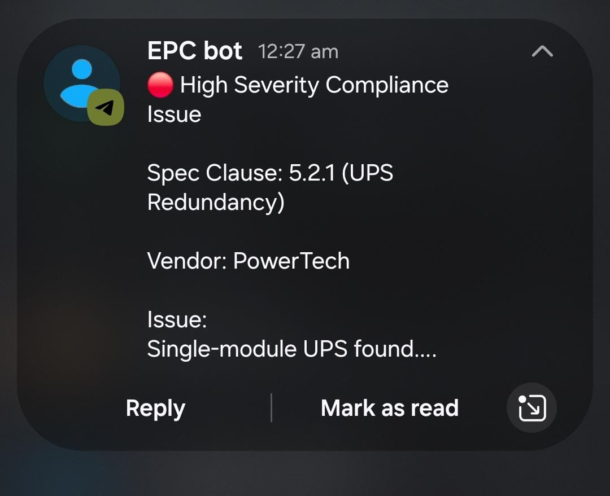
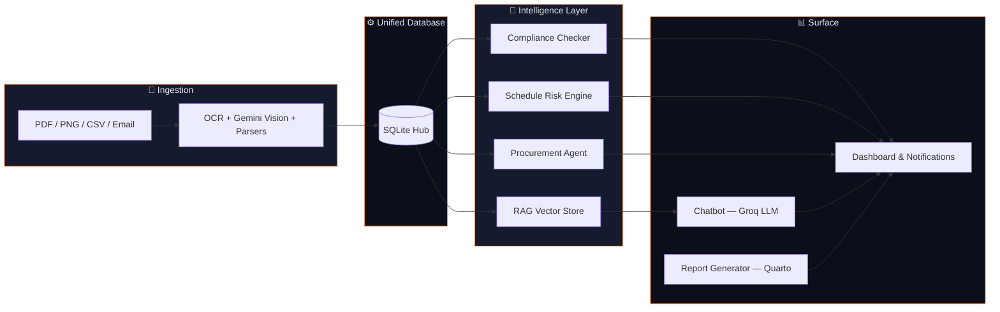

<div align="center">


<br/>

<a href="#-quick-start">

</a>

<br/><br/>


<br/>


</div>

<br/>

<div align="center">

</div>

<br/>

> **Project Intelligence** is a memory-backed command center for data-centre construction. Every document a project generates — drawings, specs, procurement records, emails, meeting minutes — is ingested and structured automatically. A **Compliance Agent** checks it against standards the moment it lands. A **Risk Engine** forecasts schedule delays before they happen. A **RAG chatbot** answers any project question with citations pulled straight from the document store. The dashboard shows every step of that pipeline, live.

<br/>

## 📍 Live Local Links

<div align="center">

| Service | URL |
|---|---|
| 🖥️ App (frontend + API, unified) | `http://127.0.0.1:8010/dashboard` |
| ⚙️ Backend entrypoint | `app.unified_main:app` |
| 🧩 Legacy entrypoint *(optional)* | `app.main:app` |
| 🧠 RAG endpoint | `POST /api/v1/intelligence/chat` |
| 📄 Report generation | `/reports` |

</div>

<br/>

## 🧨 The Problem

Construction teams keep losing time to the same three failure modes, project after project:

<table>
<tr>
<td width="33%" valign="top">

### 📁 Scattered Documents
Drawings, specs, emails, and procurement records live across folders, inboxes, and vendor portals — never in one place, never searchable.

</td>
<td width="33%" valign="top">

### 🐢 Manual Compliance Review
Checking every incoming document against specs and standards by hand takes days and still misses mismatches.

</td>
<td width="33%" valign="top">

### ⏰ Risk Discovered Too Late
Schedule and procurement delays usually surface only after they've already hit the critical path.

</td>
</tr>
</table>

Project Intelligence fixes all three with one runtime loop: **ingest → extract → check → forecast → answer.**

<br/>

## 🧠 How It Works



<details>
<summary><b>📜 See the raw end-to-end runtime flow (text version)</b></summary>

<br/>

```text
User uploads a document
  → Preview panel extracts before commit
  → Commit Upload triggers extraction (native PDF text, OCR, or Gemini Vision)
  → Structured data persists to the unified database
  → Automatic compliance check runs against specs and standards
  → Communication extraction runs if the doc is an email / RFI / meeting note
  → Notification engine refreshes and fires alerts
  → RAG vector store rebuilds so chat stays current
  → Dashboard, compliance, schedule, and procurement views update live
```

</details>

<br/>

## 🎬 The Core Demo Story

> A site team uploads a new **procurement change order** for the chiller delivery on the Orion Data Centre Campus build.

Project Intelligence extracts the document, flags that the revised ETA pushes **Busway sections** into a **yellow** delay risk against the critical path, and the Compliance Agent confirms the vendor certification is still valid. The Risk Engine recolors the Gantt chart and recommends expediting the fiber trunk shipment to protect the schedule.

<table>
<tr>
<th>🚫 Before</th>
<th>✅ After</th>
</tr>
<tr>
<td>

```
Manual PDF review
Delay found after the fact
No supplier scorecard visibility
Compliance checked by hand
```

</td>
<td>

```
Auto-extracted on upload
Delay flagged before it lands
Supplier scorecards live on map
Compliance Agent flags in real time
```

</td>
</tr>
</table>

<br/>

## 🖼️ Inside the Workspace

<div align="center">

<table>
<tr>
<td width="50%" align="center">
<b>Document Hub</b><br/><br/>

</td>
<td width="50%" align="center">
<b>Procurement &amp; Shipment Map</b><br/><br/>

</td>
</tr>
</table>

<br/>

<b>Live Command Center</b><br/><br/>


<br/>

<table>
<tr>
<td width="50%" align="center">
<b>Smart Notifications — Telegram Bot</b><br/><br/>

</td>
<td width="50%" valign="middle">

High-severity compliance flags don't wait for someone to open the dashboard — the **EPC bot** pushes them straight to Telegram the moment they're detected, with the spec clause, vendor, and issue summary already attached.

</td>
</tr>
</table>

</div>

<br/>

## 🏗️ Architecture



Project Intelligence is a full-stack construction intelligence platform with four connected layers:

1. **Document Hub** — upload PDFs, drawings, CSVs, emails, DOCX, XLSX. Native PDF text extraction first, OCR for scans, Gemini Vision for schematics.
2. **Unified Database** — every extracted fact lands in one SQLite hub — the single source of truth behind every other module.
3. **Intelligence Layer** — a deterministic + Groq-reviewed Compliance Checker, a FAISS-backed RAG store, a Schedule Risk Engine, and a Procurement Agent all read from the same hub.
4. **Surface** — the RAG chatbot, Quarto-generated reports, and the live dashboard all expose that intelligence back to the team, with smart notifications on top.

<br/>

## 📂 Project Structure

```text
platform/
├── backend/
│   ├── app/
│   │   ├── unified_main.py           # verified unified entrypoint
│   │   ├── main.py                   # legacy entrypoint (optional)
│   │   ├── services/
│   │   │   └── intelligence_hub.py   # extraction, compliance, RAG, risk
│   │   └── api/
│   │       └── endpoints/
│   │           └── intelligence.py
│   ├── vector_store/                 # FAISS index + chunks
│   ├── data/                         # seeded sample docs, CSVs, PDFs
│   ├── requirements.txt
│   └── .env
│
├── frontend/
│   ├── dist/                         # backend-served SPA (verified path)
│   │   ├── index.html
│   │   └── assets/
│   │       ├── app.js
│   │       └── app.css
│   └── src/                          # React/Vite source (future dev)
│       ├── pages/intelligence/*
│       └── components/chat/FloatingChat.tsx
│
├── ARCHITECTURE.md
└── INTEGRATION_AUDIT.md
```

<br/>

<details>
<summary><b>📄 Important files — click to expand</b></summary>

<br/>

### `backend/app/services/intelligence_hub.py`
Core intelligence layer. Handles document extraction (native PDF text, OCR, Gemini multimodal for drawings), deterministic + Groq-reviewed compliance evaluation, RAG chunking into the FAISS vector store, schedule/procurement/communications engines, and notification refresh.

### `backend/app/api/endpoints/intelligence.py`
REST surface for the hub — upload/commit, compliance, RAG chat, schedule risk, procurement, and the first-class equipment/vendor/requirement/standard/rule-evaluation tables:

```text
POST /api/v1/intelligence/upload
POST /api/v1/intelligence/commit
POST /api/v1/intelligence/chat
GET  /api/v1/intelligence/equipment
GET  /api/v1/intelligence/vendors
GET  /api/v1/intelligence/requirements
GET  /api/v1/intelligence/standards
GET  /api/v1/intelligence/compliance/rule-evaluations
```

### `frontend/dist/`
The verified, backend-served SPA — top bar, project switcher, global search, notification panel, floating chat drawer, and every module page (`/dashboard`, `/documents`, `/compliance`, `/schedule`, `/procurement`, `/communications`, `/knowledge`, `/chat`, `/reports`, `/settings`). Runs without `npm`.

### `frontend/src/`
Optional React/Vite source kept for future component development. Not required for the verified run path.

</details>

<br/>

## ✨ Core Capabilities

<table>
<tr>
<td width="50%" valign="top">

**📁 Centralised Document Hub**
Upload any project file. OCR handles scans, Gemini Vision reads schematics, NLP parses correspondence — everything lands in one searchable database.

**✅ Automatic Spec Compliance Agent**
Every document is compared against specs and standards. Mismatches and missing certifications are flagged with severity, side-by-side — cutting manual review by roughly **80%**.

**📈 Predictive Schedule Risk Engine**
Schedule, procurement status, and historical patterns predict delays before they happen and recolor the Gantt chart with mitigation recommendations.

</td>
<td width="50%" valign="top">

**🚚 Supply Chain &amp; Procurement Tracker**
A live shipment map and supplier scorecards. Alerts fire the moment a late delivery threatens the critical path.

**🤖 AI Knowledge Assistant (RAG Chatbot)**
Ask any project question from any screen. Answers are retrieved from project documents, with citations.

**📄 Automated Report Generation**
Weekly, monthly, or on-demand PDF reports, regenerated through Quarto with a single command whenever the data changes.

</td>
</tr>
</table>

<br/>

## 🚀 Quick Start

### 1 · Set Up the Backend

```bash
cd platform/backend
python -m venv .venv
.venv\Scripts\activate
pip install -r requirements.txt
```

### 2 · Configure Environment

<details>
<summary><b>Create <code>backend/.env</code></b></summary>

<br/>

```env
GROQ_API_KEY=your_groq_key
GEMINI_API_KEY=your_gemini_key
GOOGLE_API_KEY=your_gemini_key
GEMINI_MODEL=gemini-1.5-flash
OPENWEATHER_API_KEY=your_openweather_key
TWILIO_ACCOUNT_SID=your_twilio_sid
TWILIO_AUTH_TOKEN=your_twilio_token
TWILIO_FROM_NUMBER=your_twilio_sms_number
ALERT_RECIPIENT_PHONE=recipient_phone
SMTP_HOST=
SMTP_USER=
SMTP_PASSWORD=
DATABASE_URL=sqlite+aiosqlite:///./ai_monitoring.db
SEED_DEMO_DATA=true
```

| Missing key | Fallback behaviour |
|---|---|
| `GROQ_API_KEY` | RAG answers switch to local extractive retrieval |
| `GEMINI_API_KEY` / `GOOGLE_API_KEY` | Drawing/image analysis falls back to OCR/text extraction |
| `OPENWEATHER_API_KEY` | Procurement uses persisted fallback weather signals |
| Twilio / SMTP | Notifications stay in-app; delivery attempts are logged as skipped |
| Quarto not on `PATH` | Report generation falls back to a PyMuPDF-built PDF |

The app runs fully without any keys configured — every integration has a deterministic or local fallback.

</details>

### 3 · Run It

```bash
python -m uvicorn app.unified_main:app --host 127.0.0.1 --port 8010
```

Open **`http://127.0.0.1:8010/dashboard`**.

`app.unified_main:app` is the verified entrypoint. `app.main:app` remains available if you want the legacy project-monitoring routes and their full dependency set.

**Default demo login:** `admin@example.com` / `Admin@123` *(only if the standalone auth page is used — local demo mode opens straight into the dashboard)*.

<br/>

## 🎯 Demo Walkthrough

<details open>
<summary><b>⚡ Fastest demo path</b></summary>

<br/>

1. Open `/documents` — sample files are seeded automatically.
2. Preview, then commit, an upload.
3. Watch extraction, compliance check, and notification fire.
4. Open `/compliance` — show the flagged issue with severity and evidence.
5. Open `/procurement` — show the shipment map and supplier scorecards.
6. Ask the chat drawer a question about the flagged document.

</details>

<details>
<summary><b>🧭 More complete demo path</b></summary>

<br/>

1. Open the dashboard — walk through ingestion, extraction, compliance, RAG, and risk tiles.
2. Open `/documents` and commit an upload — a PDF, drawing, or email export.
3. Open `/compliance` — review flags grouped by source document.
4. Open `/schedule` — inspect the Gantt-style risk overlay and mitigation suggestions.
5. Open `/procurement` — review Kanban lanes, the shipment map, and supplier scorecards.
6. Open `/communications` — review extracted action items, or use **Import Gmail**.
7. Open `/knowledge` — review extracted equipment, vendor submittals, and rule evaluations.
8. Open `/appointments` — review engineer review appointments tied to open risks.
9. Open `/chat` — try: *"What is the redundancy requirement for UPS in Hall 3?"*
10. Open `/reports` and generate the default weekly report for the last 7 days.

</details>

<br/>

## 📡 API Reference

<details>
<summary><b><code>POST /api/v1/intelligence/upload</code></b> — preview extraction before commit</summary>

<br/>

Accepts a PDF, image, CSV, JSON, DOCX, or XLSX file and returns the extraction preview without writing to the database.

</details>

<details>
<summary><b><code>POST /api/v1/intelligence/commit</code></b> — commit an upload to the hub</summary>

<br/>

Persists extracted data, runs the compliance check, refreshes notifications, and rebuilds the RAG vector index.

</details>

<details>
<summary><b><code>POST /api/v1/intelligence/chat</code></b> — RAG knowledge assistant</summary>

<br/>

```bash
curl -X POST http://127.0.0.1:8010/api/v1/intelligence/chat \
  -H "Content-Type: application/json" \
  -d '{"query": "What is the redundancy requirement for UPS in Hall 3?"}'
```

Response includes the answer plus citations to the source documents. Falls back to local extractive retrieval without a Groq key.

</details>

<details>
<summary><b><code>GET /api/v1/intelligence/{equipment|vendors|requirements|standards}</code></b> — knowledge base tables</summary>

<br/>

First-class tables for equipment, vendor submittals, engineering requirements, and standards, all populated automatically during extraction.

</details>

<br/>

## 🔗 Integrated Intelligence Modules

- Document extraction: native PDF text first, OCR for scans/images, Gemini multimodal when configured.
- Gemini drawing/schematic analysis feeds extracted visual insight directly into the DB, RAG, and compliance pipelines.
- Procurement uses a delivery-map model with OpenWeather route/weather risk scoring.
- Email import via a read-only Gmail adapter; SMTP for notifications; Twilio-compatible SMS/WhatsApp dispatch behind smart notifications.
- Compliance combines deterministic rule evaluations, severity-weighted vendor submittal status, and Groq-based review (`llama-3.1-8b-instant`).
- RAG persists chunks to `backend/vector_store/`, using `sentence-transformers/all-MiniLM-L6-v2` embeddings with FAISS when available.
- Reports are generated through the Quarto CLI, with a PyMuPDF fallback stored in report history when Quarto isn't available.

<br/>

## 🔐 Security Notes

> [!IMPORTANT]
> Never hardcode API keys in source code. Always use environment variables via `backend/.env`, and keep that file out of version control.

<br/>

## ✅ Current Known Truth

| Level | Behavior |
|---|---|
| **Guaranteed demo** | Runs fully offline with seeded sample data — OCR/text extraction, deterministic compliance rules, and local extractive RAG all work with zero API keys. |
| **Full intelligence** | Unlocks once Groq, Gemini, and OpenWeather keys are set — Groq-reviewed compliance, Gemini schematic analysis, and live weather-aware procurement risk. |

<br/>

## 🛠️ Troubleshooting

<details>
<summary><b>Drawing/image analysis isn't running through Gemini</b></summary>

<br/>

Check that `GEMINI_API_KEY` / `GOOGLE_API_KEY` are set in `backend/.env`. Without them, the app falls back to OCR/text extraction — ingestion still works, just without vision analysis.

</details>

<details>
<summary><b>Chat answers feel generic, no citations</b></summary>

<br/>

Set `GROQ_API_KEY`. Without it, RAG uses local extractive answers instead of generated ones.

</details>

<details>
<summary><b>Reports come out as a plain PDF instead of the styled Quarto layout</b></summary>

<br/>

Quarto isn't on `PATH`. Install Quarto, or accept the PyMuPDF fallback — report history stores whichever was generated.

</details>

<details>
<summary><b>Gemini or Hugging Face calls fail immediately</b></summary>

<br/>

Usually a local TLS certificate store issue. Gemini calls are time-bounded and RAG falls back to local deterministic embeddings automatically — ingestion and the vector store stay current regardless.

</details>

<br/>

## 📊 Impact

<div align="center">

| Metric | Improvement |
|---|---|
| Manual compliance checking | **−60%** |
| Schedule delays | **−30%** via predictive alerts |
| Information retrieval time | **−90%** via AI chat |

</div>

<br/>

<div align="center">

## 🎤 Five-Line Pitch

</div>

> Project Intelligence is a memory-backed construction command center.
> Every document a project generates is ingested, extracted, and structured automatically.
> A Compliance Agent checks it against specs the moment it lands, with Groq-reviewed severity flags.
> A Risk Engine forecasts schedule delays before they hit the critical path.
> A RAG chatbot and Quarto reports turn that intelligence into answers anyone on the team can act on.

<br/>

<div align="center">


**Built for teams who need to know, not guess, where a project stands.**

</div>
