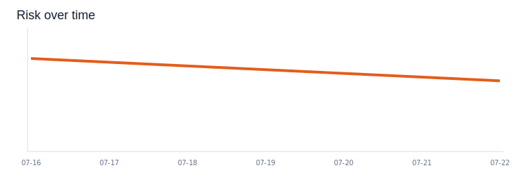
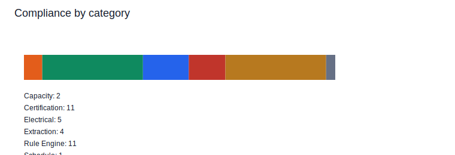

## Executive Metrics

Health Score: 0

Schedule Completion: 47.8%

Compliance Issues: 34

Procurement Risks: 3

## Analytics

## Critical Schedule Risks

| id | name | delay_probability | risk | mitigation |
|---|---|---|---|---|
| CP-101 | UPS Hall 3 installation | 0.79 | red | Expedite procurement and resequence successor work around UPS Hall 3 installation. |
| CP-102 | Chiller delivery and placement | 0.79 | red | Expedite procurement and resequence successor work around Chiller delivery and placement. |
| CP-103 | Busway energization | 0.79 | red | Expedite procurement and resequence successor work around Busway energization. |
| CP-104 | Containment inspection | 0.54 | yellow | Confirm vendor ETA and add recovery float for Containment inspection. |
| T-005 | Task 5 | 0.39 | yellow | Confirm vendor ETA and add recovery float for Task 5. |

## Procurement Risks

| id | material | supplier | eta | risk |
|---|---|---|---|---|
| PO-1001 | UPS modules | VoltGrid | 2026-07-24 | yellow |
| PO-1002 | Chillers | ThermaCore | 2026-07-18 | red |
| PO-1004 | Busway sections | PowerRail | 2026-07-27 | yellow |
